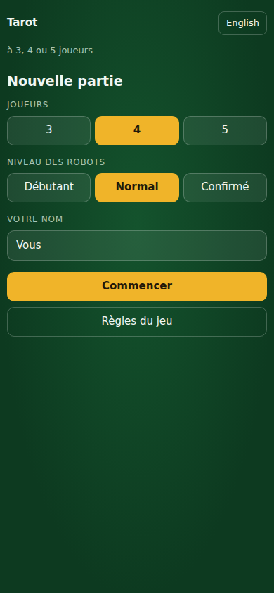
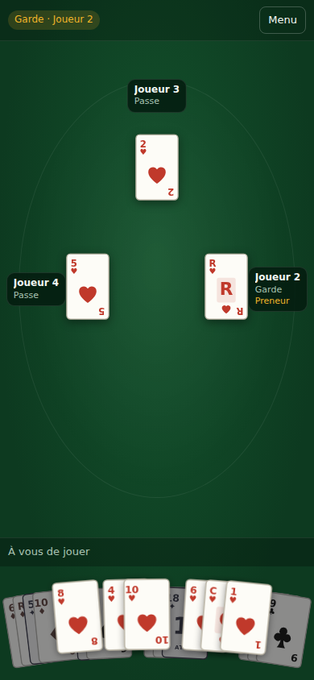
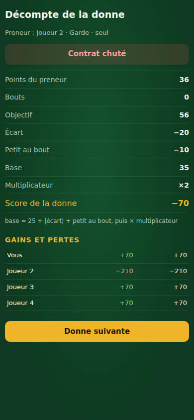

# Tarot

A playable **French Tarot** (*jeu de tarot*) for 3, 4 and 5 players: the
trick-taking card game with 78 cards, bids and the Petit. Solo against bots with
no network at all, and table play where everyone at the table uses their own
phone with no internet connection.

Nothing here has anything to do with tarot cartomancy.

## Status

Build order is the one in `docs/spec.md`. Work stops and reports after steps 3,
6 and 9.

| Step | | |
|---|---|---|
| 0 | Transport spike + ADR | ⚠️ decided on desk research; on-device demo still outstanding, see [`docs/adr-transport.md`](docs/adr-transport.md) |
| 1 | Engine: deck, deal, legal moves, tricks | ✅ |
| 2 | Scoring + tests | ✅ |
| 3 | 3 and 5 players, called king | ✅ (pulled forward — the scoring tests need all three table sizes) |
| 4 | Bots + headless simulation | ✅ |
| 5 | React UI, solo vs bots | ✅ |
| 6 | PWA, offline service worker, deploy | — |
| 7 | Capacitor Android build | — |
| 8 | Table play over the chosen transport | — (the host, protocol and `LocalTransport` are in place) |

## Layout

```
packages/engine    pure TypeScript rules and scoring: no dependencies, no I/O
packages/bots      AI, depends only on the engine
packages/net       the authoritative host, the wire protocol, and LocalTransport
packages/ui        React app: solo play against bots
docs/              spec and architecture decisions
```

The engine is deliberately boring: a serialisable `GameState`, one `Action`
union, one `applyAction` reducer. It runs in Node with no browser, takes a seeded
RNG so any hand can be reproduced from its seed, and every source file is
erasable-syntax-only so `node --experimental-strip-types` runs it directly.

## Working on it

```sh
pnpm install
pnpm test            # every package
pnpm typecheck
pnpm build
```

Per package:

```sh
pnpm --filter @tarot/engine test
pnpm --filter @tarot/engine test:coverage     # thresholds are enforced at 90%
pnpm --filter @tarot/engine simulate -- --games 10000
```

The engine's own harness is a rules fuzzer: it plays whole hands with random
legal choices at all three table sizes and asserts the invariants that must hold
every time — no crash, no illegal move, all 78 cards accounted for, 91 points on
the table, and a settlement that sums to exactly zero. Random play reaches
positions no sensible bot would, which is exactly what makes it useful.

The property test (`test/property.test.ts`) does the same over 10 000 deals per
table size. Shorten it while iterating with
`TAROT_PROPERTY_DEALS=500 pnpm --filter @tarot/engine test`.

## The bots

Three levels, in `packages/bots`:

| Level | Bidding | Play |
|---|---|---|
| **Débutant** | overbids by about a point and a half | heuristic only, no search |
| **Normal** | calibrated thresholds | 30 Monte-Carlo determinisations, 150 ms budget |
| **Confirmé** | calibrated thresholds | 200 determinisations, 400 ms budget |

A bot's whole API is `decide(view: PlayerView): Action`. A `PlayerView` has no
field holding another player's hand, the unseen chien or the taker's écart, so a
bot *cannot* read hidden information — the boundary is the type, not a promise
about how `decide` is written. `test/bot.test.ts` walks whole hands at every
table size asserting that nothing private ever reaches a view.

**Bidding** scores a hand in "bid points" — bouts, trump length, high trumps,
honours, and a shape that lets you ruff, minus a charge for a long dead side
suit. Every weight and threshold is in `src/config.ts`.

**Écart** costs each candidate by what it gives up: cheap cards from short suits
with no king in them are ideal, since they buy a void to ruff into; stripping a
dame bare is charged for. Trumps go in only when the rules force them, lowest
first.

**Play** at Normal and Confirmé deals the unseen cards into a layout consistent
with everything the seat has worked out — who failed to follow which suit, who
under-trumped when obliged to overtrump, what the écart is forbidden to contain,
which cards the table watched go into the taker's hand from the face-up chien —
plays each candidate out to the end, scores the hand properly, and keeps the
running average. At five players the sample also decides who holds the called
king, which is to say who the partnership is.

### Calibration

Thresholds are set from measurement, not taste:

```sh
pnpm --filter @tarot/bots calibrate                  # percentiles + bid distribution
pnpm --filter @tarot/bots calibrate -- --fast        # same, with the search off
pnpm --filter @tarot/bots calibrate -- --matchup     # levels head to head
```

As configured, roughly 3–7% of deals are passed out and the hands that are
played split about 40/45/11/3 across Petite, Garde, Garde Sans and Garde Contre.

Head-to-head at four players, seats alternating:

| Matchup | Points per hand per seat | Hands |
|---|---|---|
| Normal vs Débutant | **+37.7 ± 4.0** | 584 |
| Confirmé vs Normal | +3.7 ± 6.3 | 208 |

Having a search at all is worth a great deal, and is far outside the noise.
Going from Normal's 30 determinisations to Confirmé's 200 is **not** measurably
better at that sample size — the difference is well inside one standard error,
for six times the thinking time. The likely reason is that every rollout is
driven by the same crude greedy policy, so more samples estimate the same biased
number more precisely rather than playing better. Sharpening the rollout policy
is step 10's job; until that is done, do not read Confirmé as the stronger bot
just because it thinks for longer.

### Simulation

```sh
pnpm --filter @tarot/bots simulate -- --games 10000 --level debutant
pnpm --filter @tarot/bots simulate -- --games 100 --players 4 --level normal
```

Runs whole hands with a bot in every seat and asserts no crash, no illegal move,
all 78 cards accounted for, 91 points on the table, and a settlement of exactly
zero. Because each bot is driven through `playerView`, this exercises the same
path a networked table will take. CI runs 10 000 hands per table size at
Débutant plus smaller runs of the two searching levels, which are far slower per
move.

## The app

<p>
  
  
  
</p>

French by default, English available, portrait phone first. Card faces are drawn
from scratch as SVG — no deck artwork, nothing traced: suits use the standard
pips, trumps are numbered tiles in their own colour, and the three bouts carry a
small marker.

A few things worth knowing about the table screen:

- **Legal moves are obvious.** Illegal cards are dimmed and inert and say why
  when tapped ("vous devez monter à l'atout"). Legal cards are lifted, are given
  more of the fan's width than the rest, and are stacked above the dimmed ones —
  a card you are allowed to play is never buried under one you are not.
- **The chien is turned face up** in the middle of the table on a Petite or a
  Garde, for everyone, exactly as the rules say. The écart is built by tapping,
  and the cards the rules protect refuse the tap with a reason.
- **The score breakdown** after every hand lists points, bouts, target,
  difference, multiplier, every bonus, and who pays whom. It is the screen people
  argue over, so nothing is rolled up.
- **Undo** takes back your last card and everything the bots played after it. It
  appears in solo play only; the host refuses it outright at a real table.
- The rules reference and the scoring cheat sheet are built in, in both
  languages.

```sh
pnpm --filter @tarot/ui dev        # http://localhost:5173
pnpm --filter @tarot/ui build      # static site in packages/ui/dist
pnpm --filter @tarot/ui preview
```

## How a seat talks to the table

Solo play is not a special case. `packages/net` holds the authoritative host —
it owns the deal and the game state, and hands each seat a `PlayerView` and
nothing else, so no screen can render a card it is not entitled to see. The UI
only ever holds a `TableClient`.

```
TableScreen ─▶ TableClient ─▶ Transport ─▶ TableServer ─▶ GameHost ─▶ engine
                                  │
                 LocalTransport (solo, one process)  /  p2p (step 9)
```

The host also plays the bot seats, and plays a human seat whose device has
dropped — which is the whole mechanism behind the reconnect handling the spec
asks for; only the timeout policy is still to come. Swapping `LocalTransport`
for the transport chosen in the ADR is what step 9 amounts to.

### Building the app

- **Web:** `pnpm --filter @tarot/ui build`, then deploy `packages/ui/dist` to
  GitHub Pages, Netlify or Cloudflare Pages. Static hosting, no backend. The
  build uses relative asset paths so it works from a subdirectory; set
  `VITE_BASE=/` for a domain root. It is **not yet an installable PWA** — there
  is no service worker, so it does not run offline after a reload. That is
  step 7.
- **Android APK:** not yet — Capacitor is step 8. When it lands:
  `pnpm --filter @tarot/ui build && npx cap sync android && npx cap open android`,
  then Build → Generate Signed Bundle/APK. Target is Android 9+.

## Tests

| Package | Tests | Statements | Branches |
|---|---|---|---|
| `engine` | 137 | 99.8% | 98.8% |
| `bots` | 73 | 98.9% | 95.5% |
| `net` | 24 | 99.1% | 89.7% |
| `ui` | 63 | 97.8% | 88.7% |

The engine's threshold is the spec's 90%; the others are set a little lower on
branches, where a defensive `catch` is not worth contorting a test for.

## Rules notes

The engine implements the rules in `docs/spec.md`. Two places where real tables
differ, and what we do:

**Half points.** Card values are held as integers in half-points (`points2`:
Roi 9, Dame 7, Cavalier 5, Valet 3, bout 9, everything else 1, totalling 182 =
91 points) so nothing ever touches a float. The difference from the contract
target is *not* rounded, so a score can end in `.5`. Tables that round exist;
we follow the spec and keep the arithmetic exact.

**Petit au bout when the contract fails.** The spec puts the ±10 inside the
multiplied base, which means a contract that fails while the defence holds the
petit au bout costs the taker *less*. The FFT rule instead credits 10 ×
multiplier to whichever side won it, independently of the contract. Both are
implemented; the spec's reading is the default:

```ts
createHand({ playerCount: 4, seed: 1, rules: { petitAuBoutIndependentOfContract: true } });
```

## Licence

MIT.
